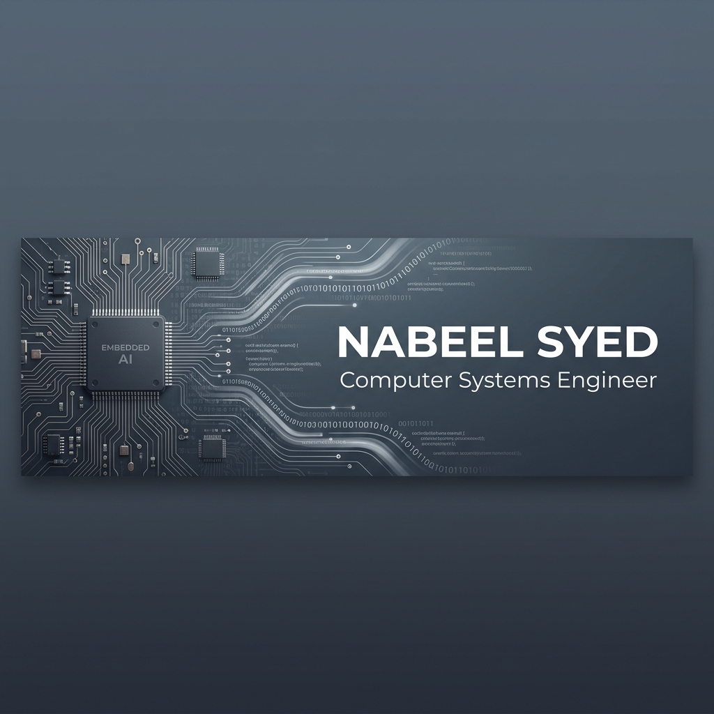

  

  <h3>Computer Systems Engineering Student | Embedded AI & Machine Learning</h3>
  
Bridging AI research and real-world engineering applications through intelligent, data-driven systems.

  
  

---

### 🔭 About Me
I am a **Computer Systems Engineering** student at **Middlesex University Dubai**, specializing in the intersection of **Embedded Systems** and **Machine Learning**. I design and deploy Edge AI solutions, sensor-driven automation, and full-stack AI applications.

- 🌱 Currently mastering **Edge AI** and **Hardware-Software Co-Design**.
- 🔬 Researching **Vision-Grounding frameworks** to prevent AI hallucinations in IoT.
- ⚡ Fun fact: I've built everything from personal knowledge graphs to autonomous room automation systems.

---

### 🛠️ Technical Skill Set

| Category | Skills |
| :--- | :--- |
| **Languages** |     |
| **AI & ML** |     |
| **Embedded & IoT** |     |
| **Engineering Tools** |     |

---

### 🚀 Key Projects

#### 🧠 [Recall - AI Knowledge Retention Hub](https://github.com/nabeelsyed14/recall)
*Personal knowledge engine that turns digital content into queryable knowledge.*
- **Core Tech:** React, FastAPI, Supabase, Groq (Llama 3.3 70B).
- **Innovation:** Automated ingestion (YouTube/Articles), AI-generated quizzes, and a full-text search Knowledge Graph.
- **Features:** Streaming "Chat with Content" and a markdown-based retention system.

#### 🌌 [LuminaData - Privacy-First Data Intelligence](https://github.com/nabeelsyed14/lumina-data)
*Professional AI platform for multi-dataset exploration and visualization.*
- **Core Tech:** React (Vite), FastAPI, Ollama (Local AI) & Google Gemini.
- **Innovation:** Cross-dataset Global Assistant and automated AI-driven chart generation (Matplotlib/Seaborn).
- **Safety:** Sanitized Python sandbox for secure data analysis and hallucination prevention.

#### 🍎 [NutriScale - IoT AI Smart Meal Tracker](https://github.com/nabeelsyed14/nutriscale)
*Full-stack IoT system combining edge processing with vision-grounding AI.*
- **Core Tech:** Raspberry Pi 5, Pi Camera, Random Forest, Flask.
- **Innovation:** Prevents AI hallucinations in nutritional tracking using a custom vision-grounding framework.

#### 🧬 [BioSync - AI-Powered Mobile Health Companion](https://github.com/nabeelsyed14/biosync)
*Context-aware health monitoring using multi-source data fusion.*
- **Core Tech:** Capacitor, MQTT, Supabase, Gradient Boosting.
- **Innovation:** Multi-source data fusion (HRV, SpO2, Environmental) to calculate a **Vitality Index**.

#### 💡 [LUMISHADE - Smart Room Automation](https://github.com/nabeelsyed14/lumishade)
*Autonomous system for lighting and blinds based on real-time sensor processing.*
- **Core Tech:** STM32 Nucleo-F429ZI, Low-power sensor fusion.

---

### 💬 Languages
- **English** (Proficient)
- **Hindi** (Native)
- **Urdu** (Native)

---

### 📫 Connect with Me

  
  

---

  

